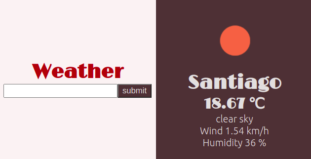

# JS-TODO List

> This APP uses OpenWeatherApi to fetch for weather information

You can:
- Look for locations in the text bar in the left side
- See the information in the right side
- Information includes: 
    - Weather icon
    - Location name 
    - Temperature in Celsius
    - Wind velocity
    - Humidity percentage
## Built With

- JS
- SASS
- Webpack
- OpenWeatherApi

## Live Demo

[Live Demo Link](https://suspicious-roentgen-bd14e2.netlify.app/)

## Getting Started

To get a local copy up and running follow these simple example steps.

### Prerequisites

- Requieres Javascript, node and a web browser

### Setup

- Clone the project from https://github.com/RokoVarano/Weather-app, currently from feature/code_review
### Install

- Go to the clone's directory
- run 'npm run build'
- run 'npx webpack serve'
- the project will be available in localhost:8080

### Usage

- Type a location name in the input bar on the left side
- Click the submit button
- Repeat to reload the page with new locations
### Run tests

- No tests yet
## Authors

👤 **Rodrigo Ibaceta**

- GitHub: [Rodrigo Ibateca](https://github.com/RokoVarano/)
- Twitter: [@Rodrigo](https://twitter.com/RodrigoIbacet11)
- LinkedIn: [LinkedIn](https://www.linkedin.com/in/rodrigo-ibaceta-a8657611a/)

## 🤝 Contributing

Contributions, issues, and feature requests are welcome!

Feel free to check the [issues page](../../issues/).

## Show your support

Give a ⭐️ if you like this project!

## Acknowledgments

- Hat tip to anyone whose code was used
- Inspiration
- etc

## 📝 License

This project is [MIT](./LICENSE.md) licensed.